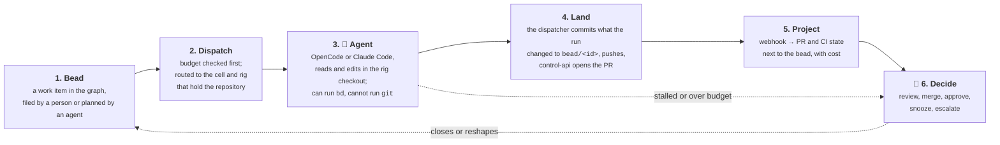
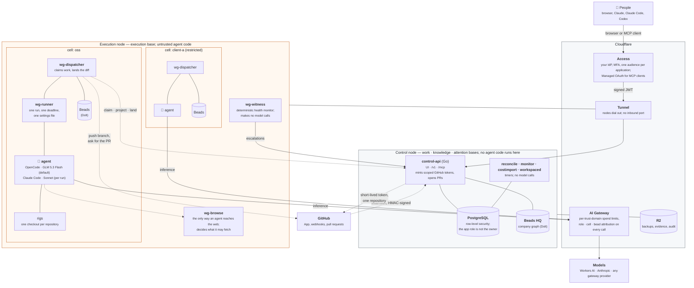

# OpenBases

**An open operating system for companies that run on agents.** Five open bases — work, knowledge,
attention, execution, improvement — that give every project, decision and agent a shared, governed
home. Built to run together; designed to be adopted one at a time.

Built and operated by [Datopian](https://www.datopian.com), an eight-person open-data consultancy,
to run its own client and product work. This repository is the whole system.

> **Status: alpha.** One company runs it, on staging, for real work. Four of the five bases run today;
> the fifth (improvement) is designed and not built. There is no production deployment yet. This
> README describes what runs; what does not run yet is listed [below](#what-works-today), by name.

> **On the name.** The system is OpenBases; the work base is still called Workgraph, which is what the
> whole thing was called until September 2026. The code has not been renamed and mostly should not be:
> binaries are `wg-*`, the database and its application role are `workgraph` and `workgraph_app`, bead
> labels are `wg-project-<slug>`, and the MCP tools are `workgraph_*` — all of which belong to the work
> base and are correct there. Where you see `wg` or `workgraph` below, it is the work base or its
> heritage, not a rename left half-done.

## The five bases

Each base solves one part of running a company with agents in the loop. They share one control plane,
one identity model and one permission model, and none of them approves its own work.

| Base | What it answers | Where it lives here |
|---|---|---|
| **Work** — *Workgraph* | What needs to happen, and what is blocking it. Projects, portfolios, beads, dependencies, approvals, and the evidence behind every close. One graph, not a dozen boards. | [Beads](https://github.com/gastownhall/beads)/Dolt graphs · `internal/work` · `internal/approvals` · the registry (`projects`, `portfolios`, `role_grants`) · `wg` CLI · `/mcp` tools |
| **Knowledge** | What the company knows, and where it came from. A meeting or document becomes a typed *candidate*; a named human accepts it; only then is it a record, carrying source, reviewer and classification. | `internal/ingest` · `internal/knowledge` · `internal/publish` · `workspaced` (Google Meet and Drive) · the classification policies |
| **Attention** | What needs a human right now. A ranked, permission-aware feed of decisions, risks and stalls — assembled for one person, not broadcast to everyone. | `internal/attention` · the inbox · `wg-witness` and `wg-monitor` escalations · the chief-of-staff "ask" |
| **Execution** | Who — or what — does the work, safely. Agents run in isolated cells scoped to the repositories, tools and budget they may touch; every call is attributed; the platform, not the agent, lands the result as a pull request. | cells · `wg-dispatcher` · `wg-runner` · OpenCode / Claude Code · `wg-budget` · cost import · `wg-browse` · the GitHub App |
| **Improvement** | How the system gets better, on evidence: a proposed change to a prompt, policy or process arrives with the evidence behind it and a test that proves it worked. | `internal/improvement`, `internal/evaluation` — **designed, not built**; both packages are a `doc.go` and nothing else ([ADR-0014](docs/adr/0014-governed-self-improvement.md)) |

The word *base* is literal: each is a schema, a set of policies, and the code that enforces them,
sitting on the same PostgreSQL with row-level security. Today they deploy as one system. Making each
separately adoptable — the knowledge base without the work base, the execution base's isolation model
around agents you already run — is the direction, and the package boundaries above are where the seams
are.

## What happens to a piece of work



Steps 1 and 6 are the work base; 2–4 the execution base; 5 the work base again; the dashed edge into
6 is the attention base. Nothing on the path approves itself. An agent can propose work, edit files and
comment on its bead. It cannot push, merge, widen a classification, or change its own budget. The pull
request it produces says so in its body: *"Opened by a Workgraph agent run. Nobody has reviewed this."*

## Run it

```bash
git clone git@github.com:datopian/workgraph.git
cd workgraph
make bootstrap                          # pinned bd/dolt/gt/opencode/claude, each SHA-256 verified
export PATH="$PWD/.toolchain/bin:$PATH"
```

`make bootstrap` downloads only release artefacts and verifies each against
[`versions.lock`](versions.lock). Nothing resolves to `latest`; a mismatch aborts.

**`make dev` is not assembled yet.** It prints what it is waiting on and tells you to run the API
directly, which is the honest local mode today:

```bash
createdb workgraph
WG_ENV=local WG_DATABASE_URL=postgres://localhost/workgraph go run ./cmd/control-api
# serves the UI and /v1 on http://127.0.0.1:8080
```

Local mode is **read and plan only in practice**: dispatching an agent needs a Cloudflare AI Gateway
token, and a run without one is refused outright rather than reaching a model untagged — *"a run needs
the AI Gateway token, or its spend escapes every budget"*. There is no fixture Beads graph or sandbox
cell yet; those are the parts `make dev` is waiting on.

Deploying the full system — two Hetzner nodes behind Cloudflare Access and Tunnels, Ansible-provisioned
cells, AI Gateway, R2 backups — is described in [`infra/README.md`](infra/README.md) and the runbooks
in [`docs/runbooks/`](docs/runbooks/).

### Connect a client

Most people never open the web interface. OpenBases serves a remote MCP server at `/mcp`, so its tools
appear inside the clients people already use — Claude (desktop, web, mobile), Claude Code, Codex, and
anything else that speaks MCP over HTTP.

```bash
claude mcp add --transport http openbases https://<your-host>/mcp
```

Your browser opens the normal identity-provider login and Cloudflare Access issues the token. OpenBases
implements no OAuth of its own, and what you see through a connector is exactly what you see in the
browser ([ADR-0028](docs/adr/0028-remote-mcp-via-access-managed-oauth.md)). On a laptop with a shell,
`wg mcp` serves the same tools over stdio. Confirmed clients and how to revoke access:
[`docs/runbooks/connect-a-client.md`](docs/runbooks/connect-a-client.md).

Nine tools, the same set over both transports, so nothing is available in one client and missing in
another: the inbox, the chief-of-staff ask, work and one bead in detail, projects, **creating a project
and attaching repositories**, filing work from a brief, and dispatching. Detaching a repository and
setting a repository's check command are deliberately not tools — the first withdraws the route work
travels on, the second is executed on the execution node from a repository an agent can edit.

## How it fits together

Two machines, neither with an inbound port. Everything a person touches goes through Cloudflare Access
first; everything an agent touches is scoped to one cell.



The dashed edges are the ones that matter for security:

- **A cell never holds a git credential.** The dispatcher asks `control-api` for a token scoped to one
  repository, over an Access application bound to that single path, and gets one that expires within
  the hour. The GitHub App private key can mint tokens for *every* installed repository, so it stays on
  the control node where no agent code runs. The agent itself cannot run `git` at all.
- **GitHub webhooks bypass Access**, because GitHub cannot complete an Access challenge. An HMAC
  signature, verified before parsing, is the only thing standing between that endpoint and anyone who
  learns its URL.
- **Cells cannot see each other.** Separate Linux users, `0700` homes, a `0711` cells root so one
  cannot even enumerate the others' names, cgroup limits, and `hidepid` so one cannot read another's
  process arguments.
- **An agent reaches the web through one command** that decides what it may fetch. `wg-browse` resolves
  the host, refuses link-local and private addresses, and pins the resolution so a name cannot change
  between the check and the fetch. The node's own cloud-metadata endpoint answers `200` to `curl`, and
  is the first thing it refuses.
- **What a person sees through MCP is what they see in the browser.** Same identity, same row-level
  security, same role. No pasted tokens.

Known limits are listed, not hidden: [`docs/go-live/threat-model.md`](docs/go-live/threat-model.md)
records the accepted risks and the conditions that would change them.

## How the registry is shaped

An organisation has portfolios (client · product · oss · internal); a portfolio has projects; a project
has repositories, a primary **and** a backup owner, and runs in one execution cell. A restricted project
must have its own cell — the schema refuses otherwise. Work lives in Beads, one graph per cell and one
company graph on the control node, and a bead is attributed to a project by its `wg-project-<slug>`
label. The older `project:<slug>` spelling is still honoured on read, and both are collected into one
set so a bead labelled both ways is caught rather than counted twice
([0082](db/migrations/0082_project_label_convention.sql)).

There are no subprojects, deliberately: nesting would make membership transitive and change the reach
of every policy that delegates to `can_read_project()`. Nine roles, scoped per project or
organisation-wide, decide what a person may do to the rows they can already see
([ADR-0026](docs/adr/0026-role-permission-matrix.md)). The organisation admin cannot approve; the
executive cannot dispatch. Separation of duties beats convenience.

## Harnesses and models

Model choice is a property of the **work**, not of whichever agent picks it up
([ADR-0018](docs/adr/0018-tiered-model-routing.md),
[ADR-0024](docs/adr/0024-multi-provider-agent-runtimes.md)). Different work wants different models —
frontier models from US labs, increasingly capable open models from China, small open models for
mechanical steps — and no team should wait on one vendor's roadmap. The harness and the model are
deployed configuration; the tool allowlist is code somebody reviews.

| Role | Harness | Model | Since |
|---|---|---|---|
| `polecat`, `crew` — the agents that do the work, **and the planner** | OpenCode | `workers-ai/@cf/zai-org/glm-5.3-flash` | 7 Sep 2026 |
| any run, on request | Claude Code | `anthropic/claude-sonnet-5` | `-runtime claude -model anthropic/claude-sonnet-5` |

Why the default moved: on the bake-off screens — context, tool use, a real fix scored on the edit — both
passed, and GLM 5.3 Flash cost **$0.0037** against Sonnet's **$0.2732** for the same passing result, with
every call arriving in `usage_records` tagged by role, cell and bead. That is not evidence that GLM
matches Sonnet on hard work; it is evidence it can do the work at all, attributably, at a fiftieth of the
price — enough to be the default when any bead can say it needs more. Measurements and their caveats:
[`docs/evaluations/`](docs/evaluations/).

Planning runs as the same role as execution, so it moved to the same model. That was not a separate
decision and it deserves one: breaking a brief into work is judgement, and it is the step whose mistakes
are multiplied by every agent that acts on its output. The screens that justified the move were an
off-by-one and a file edit — execution tasks. Nothing has yet measured decomposition.

Two rules that survived every measurement. **Context is a hard filter before quality**: OpenCode's system
prompt is ~19,900 tokens, so a model with a 24k window cannot be a worker whatever the leaderboard says.
And **no model choice beats not making the call**: the health monitor, the dispatcher and the reconciler
make none, which is why one day of idle patrol agents costing $13 became zero.

Every run is budgeted before it starts. `wg-budget` resolves the bead's own ceiling, else its project's,
else its cell's, and refuses the dispatch — a refusal the person sees in the interface, not in a journal
afterwards.

## What works today

*Updated 8 September 2026. If this table and the code disagree, the code is right and this is a bug.*

| Base | Capability | State |
|---|---|---|
| Work | Login via Cloudflare Access; projects, work, inbox, ask in the browser | works |
| Work | Remote MCP (`/mcp`) with Access Managed OAuth; `wg` CLI; `wg mcp` stdio | works — confirmed clients in the runbook |
| Work | Brief → agent plans → beads under a project; create a project and attach repositories from MCP | works |
| Work | Bead detail — outcome, the agent's own words, harness and model, cost, pull requests | works in the API, MCP and the bead page; a run in flight reports its harness and model, and says when its cost has not been imported yet |
| Work | Role-permission matrix enforcement | seeded; enforcement flag off until every role has a real user |
| Knowledge | Meeting transcript → typed candidates → human review → bead or knowledge PR | works via API and MCP; **no review page in the interface** — review is an API call today |
| Attention | Ranked inbox of witness and monitor escalations; four fixed chief-of-staff questions | works; approvals have no producer yet, free-text ask is by design absent |
| Execution | Dispatch → agent edits in the rig → branch → pull request → state next to the bead | works |
| Execution | Per-bead budget refusal; cost per bead from gateway import | works (cost arrives on an hourly import) |
| Execution | Isolated cells, one rig per repository, deterministic witness, `wg-browse` | works |
| Execution | A repository's own build or test command run against the change, with one retry | works where the cell can run it; **not enabled for any repository yet**, and PortalJS does not fit — `npm ci` alone needs 7m5s against a 7.5-minute budget |
| Improvement | Evidence-backed change proposals with tests | designed, not built |
| — | Local `make dev` stack | not assembled; run `control-api` directly |
| — | Production deployment | not yet; staging only |

## How this came to be

OpenBases started as a way to run [Gas Town](https://github.com/gastownhall/gastown) and
[Beads](https://github.com/gastownhall/beads) for a whole company instead of one laptop, under the name
Workgraph — which is now the name of the work base. Beads stayed: the work graph, its Dolt history and its
CLI are what agents and people share. Gas Town's orchestration did not survive contact with a headless
node, and on 26 August 2026 we replaced it with a direct runner — a working directory, a settings file,
one command — and a deterministic health monitor; the model bill roughly halved, and every agent run
became attributable ([ADR-0023](docs/adr/0023-direct-agent-runner.md)). The vocabulary (cells, rigs,
beads) is what is left of the town, and the thirty-one ADRs in [`docs/adr/`](docs/adr/) record every
turn on the way, including the ones that were wrong.

## Layout

```
apps/web/          React + TypeScript interface, embedded into control-api
cmd/               control-api · dispatcher · runner · witness · monitor · reconcile · costimport · workspaced · wg
internal/          work · knowledge · attention · improvement · approvals · authn · authz · runner · githubapp · ingest · publish …
db/migrations/     forward-only SQL; row-level security on every table holding source-derived content
infra/             OpenTofu (Hetzner, Cloudflare), Ansible (nodes, cells, harnesses), Google Workspace events
formulas/          workflow formulas
policies/          policy bundles evaluated by the approval engine
skills/            the skill for agents that use OpenBases as a tool
docs/adr/          architecture decision records — start here for "why"
docs/evaluations/  measured model and harness results, dated
docs/runbooks/     operator runbooks
test/              contract (real bd), integration (real PostgreSQL), acceptance (against staging)
versions.lock      the pinned, checksummed toolchain: bd, dolt, gt, opencode, claude, node, chrome-headless-shell
```

## Contributing

Read [`AGENTS.md`](AGENTS.md) before your first change. The short version: every change is attached to
a bead; one bead, one branch `bead/<id>-<slug>`, one pull request; close a bead with evidence, not an
opinion; never commit a secret; never publish unreviewed model extraction; never widen a
classification; nothing approves itself. Much of this repository was written by agents running inside
it, and every rule above exists because one of them found the gap.

What we care about in review, in this order: does it actually work and how do you know; is the reasoning
in the repository; is it honest about what it does not do.

### Three files this repository does not have yet

Named here rather than linked, because a README that links to files that do not exist is the first
thing a newcomer finds broken:

- **`LICENSE`** — there is none, so default copyright applies and nobody has been granted rights to
  use, copy or modify this. Calling the system "open" while shipping no licence is a contradiction to
  close before any public release. The intent is Apache-2.0; adding it is Datopian's decision, not
  something to infer here.
- **`SECURITY.md`** — no disclosure address is published. Until there is one, report security issues
  privately to Datopian directly. [`docs/go-live/threat-model.md`](docs/go-live/threat-model.md)
  records the accepted risks, which is not the same as telling somebody where to send a finding.
- **`CONTRIBUTING.md`** — the rules above and [`AGENTS.md`](AGENTS.md) are what exists. `AGENTS.md` is
  written for agents and read by people, which has worked so far and is not an argument that it should
  stay that way.
