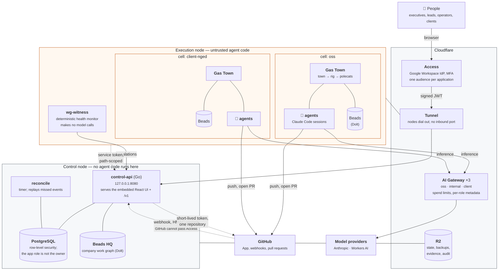
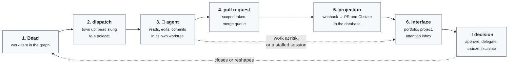

# Datopian Workgraph

A shared, permissioned company control plane: one durable work graph, a company-wide attention
layer, and controlled execution by humans and agents.

- **Work state** lives in Beads/Dolt.
- **Software execution** happens in isolated Gas Town execution cells.
- **Durable knowledge** lives in reviewed Beads and Git-native documents.
- **Code, infrastructure, policy, and reviewed knowledge** live in GitHub, and change through
  pull requests.

The implementation specification is the approved baseline v1.1 in
[`datopian/company-workgraph`](https://github.com/datopian/company-workgraph) under `plan/`.
Decisions that shape this codebase are recorded in [`docs/adr/`](docs/adr/).

## How it fits together

Two machines, neither with an inbound port. Everything a person touches goes through Cloudflare
Access first; everything an agent touches is scoped to one security domain.



The dashed edges are the ones that matter for security:

- **A cell never holds a git credential.** It asks `control-api` for a token scoped to one
  repository, over an Access application bound to that single path, and gets one that expires
  within the hour. The GitHub App private key can mint tokens for *every* installed repository, so
  it stays on the control node where no agent code runs.
- **GitHub webhooks bypass Access**, because GitHub cannot complete an Access challenge. An
  HMAC signature is the only thing standing between that endpoint and anyone who learns its URL.
- **Cells cannot see each other.** Separate Linux users, `0700` homes, a `0711` cells root so one
  cannot even enumerate the others' names, cgroup limits, and `hidepid` so one cannot read
  another's process arguments — where a gateway token would otherwise be visible.

## How the registry is shaped

There are no subprojects. The grouping level is the portfolio, and it already exists.

```mermaid
flowchart TD
    org["<b>organisation</b>"]
    pf["<b>portfolio</b><br/><small>client · product · oss · internal</small>"]
    proj["<b>project</b><br/><small>slug unique per organisation<br/>primary AND backup owner, both required</small>"]
    repo["<b>project_repositories</b><br/><small>provider/owner/name, unique per provider<br/>so a repository belongs to at most one project</small>"]
    fn["<b>function</b><br/><small>cross-cutting: engineering, delivery, marketing</small>"]
    cell["<b>execution_cell</b><br/><small>where the work runs<br/>a restricted project must have its own</small>"]
    graph[("<b>beads_database</b><br/><small>the work graph<br/>company · project · function · personal</small>")]

    org --> pf --> proj --> repo
    org --> fn -.->|"a project belongs to at most one"| proj
    proj -.->|"runs in"| cell
    cell --> graph
```

Read as a sentence: an organisation has portfolios, a portfolio has projects, a project has
repositories. A project optionally belongs to one function, and runs in one execution cell. The
work itself lives in Beads, in a graph attached to a cell.

**A project has no parent project.** `projects` carries `portfolio_id`, `function_id` and
`execution_cell_id`, and there is no `parent_project_id` — nothing in the schema or the policies
contemplates nesting. If a body of work needs subdivision, it becomes several projects under one
portfolio, or one project whose beads carry an epic. Adding real subprojects would mean a schema
change *and* a rewrite of `can_read_project()`, because membership would have to become
transitive; the reach of every policy that delegates to it would change at the same time.

**A cell may serve more than one project.** That is what a shared proof-of-concept sandbox is,
and it has a consequence worth knowing: a bead is attributed to a project by the
`project:<slug>` label it carries, and only falls back to the cell when the cell serves exactly
one project. A bead in a shared cell with no label belongs to no project and shows an empty
project column.

Creating a project: `POST /v1/projects`, or the **New project** button on the portfolio view. The
primary owner defaults to the caller; a backup owner is required and must be somebody else,
because the schema refuses full-cycle ownership by one person. Both owners are made members —
without that the project is invisible to the very people responsible for it, since
`can_read_project()` grants access by membership or by an organisation-wide
`organisation_admin` / `executive` grant, and by nothing else.

## How one unit of work moves



The town comes up for a dispatch and is torn down after it, in a trap rather than on the happy
path. Patrol agents that poll cost money for as long as they are running, whether or not there is
work — on one day of testing they made more requests than the work they were supervising. The
health monitor that replaced the largest of them makes no model calls at all.

Nothing on the return path approves itself. An agent can open a pull request; it cannot merge one,
widen a classification, or decide its own budget.

## Which model does which work

Model choice is a property of the **work**, not of whichever agent picks it up. A classification
and an architecture review are not the same job and should not cost the same, and the default —
whichever model the harness happens to reach for — is not a decision anybody made. The reasoning is
[ADR-0018](docs/adr/0018-tiered-model-routing.md); this is what it means in practice.

### What actually runs today

Two models still do all of the platform's work, and that is now a choice rather
than a constraint:

| Model | What it runs |
|---|---|
| `anthropic/claude-sonnet-5` | workers — `polecat` and `crew`, the agents that do the work |
| `claude-haiku-4-5` | patrol — `mayor`, `deacon`, `witness`, `refinery`, `dog`, `boot` |

**Reaching another provider is a flag, not a project.** `wg-runner` takes a
runtime the way it takes a model: `-runtime opencode -model
workers-ai/@cf/moonshotai/kimi-k2.7-code` runs that model through the same
gateway, with the same per-bead budget, and the spend lands attributed to the
role, cell and bead like any other run. Both roles still default to
`claude`, because changing what executes model output against our repositories
deserves a decision rather than a side effect.

What made that possible: OpenCode is installed and pinned on the execution node
alongside `gt`, `bd` and `dolt`, and it carries the gateway's attribution headers
intact — which was the one thing that could have sunk
[ADR-0024](docs/adr/0024-multi-provider-agent-runtimes.md), and is why the first
bead of that plan was a half-day spike rather than a build.

**Which models can be workers is decided by measurement, and context decides it
first.** OpenCode's agent system prompt is about 19,900 tokens, so a model needs
roughly four times that to host the prompt and still have room to work.
`llama-3.3-70b` has a 24,000-token window: it is the best T0 classifier we
measured and cannot be a worker at all. The two facts are unrelated, and no
leaderboard would have told us the second.

Of the current candidates only `qwen3-30b` fails that bar. The first version of
that screen dropped `gemma-4-26b` too, on a context figure written from
assumption rather than read from Cloudflare's documentation — three of seven were
wrong, all too small. The harness is `scripts/model_bakeoff.sh`; the results and
the correction are in [`docs/evaluations/`](docs/evaluations/).

Ranking the survivors is blocked on `wg-azd`: an OpenCode run started by
`wg-runner` fails as soon as it needs a tool, while the same task succeeds when
OpenCode is invoked from a shell with the identical configuration.

The role and model tables are deployed configuration, not Go constants — moving
a role onto a newer model is an Ansible variable and a deploy. The **tool
allowlist deliberately is not**: whether an agent may run arbitrary shell stays
a change to code somebody reviews.

Opus does not appear in any role map and the platform never selects it. The Opus
spend in the gateway logs is untagged, which is what a developer's own Claude
Code session looks like — not the agents.

The tiers below are still a **decision, not a description** for T0–T2: their only
planned caller is control-plane inference, and that is not built (`wg-sn4`).

### Four tiers (designed; T0–T2 have no caller yet)

| Tier | Default model | Work it is for |
|---|---|---|
| **T0** mechanical | `@cf/meta/llama-3.3-70b-instruct-fp8-fast` | classification, routing, tagging, extraction, short operational text |
| **T1** reasoning | `@cf/google/gemma-4-26b-a4b-it` | briefs, planning, decomposition, review, routine writing |
| **T2** coding | Kimi K2.7 Code | non-trivial implementation, debugging, repo-scale change |
| **T3** expert | `claude-sonnet-5`, then `claude-opus-5` | architecture, ambiguous failure, critical review |

Opus is off by default and needs explicit human approval. Sonnet needs a cheaper tier to have been
tried first, unless the work is marked critical.

**Switching the agent tier to a non-Anthropic model is not a configuration
change**, and it is worth knowing why before planning around it. Every agent
call goes to `…/workgraph-<env>-<domain>/anthropic` — the gateway's Anthropic
path — because Claude Code speaks Anthropic's `/v1/messages`. Point it elsewhere
and the wire format no longer matches. The two ways out are replacing Claude
Code as the harness, which Gas Town's hook integration makes more than a setting,
or a proxy that accepts `/v1/messages` and speaks `/compat/chat/completions`.
The proxy is the smaller change and is tracked as `wg-b7z`. Until one exists,
`--model` on `wg-runner` can select any Anthropic model and nothing else.

**T0 must not be a reasoning model, and that was measured rather than assumed.** The plan
originally named GLM-4.7-Flash here. Classifying fifteen real bead titles into bug/task/chore
through the staging `oss` gateway:

| Model | max_tokens | Correct | Blank | Neurons | Time |
|---|---|---|---|---|---|
| `llama-3.3-70b-instruct-fp8-fast` | 64 | **13/15** | 0 | **35.6** | **11.7s** |
| `gemma-4-26b-a4b-it` | 400 | 9/15 | 2 | 110.8 | 58.7s |
| `gemma-4-26b-a4b-it` | 256 | 3/15 | 11 | 111.6 | 56.9s |
| `glm-4.7-flash` | 1200 | 5/6 | — | 105.8 | 38.9s |
| `glm-4.7-flash` | 24 | 0/6 | 6 | 6.6 | 6.2s |

The structural finding matters more than the ranking. A reasoning model spends its budget thinking
before it answers, so at a T0-sized budget it returns **nothing at all** — GLM at 24 tokens and
Gemma at 256 both consume the budget without producing content. Give it room to finish and it costs
three times the neurons and four to five times the latency to do work that has one right answer.
That is a statement about the *tier*, not about which model is better: Gemma 4 stays the right T1
default, because T1 is briefs and review, where deliberation is the product.

Two consequences for anyone writing a caller. **Any T0 client must handle `content: null`** —
GLM-4.7-Flash returns its answer in `reasoning` with `content` empty, so a client reading only
`content` sees a blank string and no error, and silently classifies everything as blank. And the
scope of the measurement is n=15 on one task: enough to pick a default and to rule out reasoning
models at this tier, not enough to treat 13/15 as an accuracy figure.

### The work carries its own tier

A bead is meant to declare what it needs and how far it may escalate, so the *work* selects the
model rather than the agent that happens to pick it up:

```yaml
model_class: normal
max_cost_usd: 1.00
escalation: [gemma-4, kimi-k2.7-code, claude-sonnet]
```

*Designed, not built — the schema records cost per bead today, but nothing reads an escalation path
yet (`wg-fpt`).* What exists now is the per-bead **budget**, which is enforced: `wg-budget` refuses
a dispatch before an agent starts, resolving most-specific-first — the bead's own ceiling, else its
project's, else its cell's.

### Two inference planes, tiered differently

The split is forced by a real constraint, not by taste. Cloudflare's dynamic routing is reachable
only through the OpenAI-compatible `/compat/chat/completions` endpoint and is unavailable on the
REST API. Gas Town spawns Claude Code, which speaks Anthropic's `/v1/messages`, so **an agent
cannot address a dynamic route at all.**

**Control-plane inference** — extraction, classification, attention ranking, summarisation, context
preparation. We write these callers, so they can carry metadata (project, task type, risk, bead)
and get conditional routing, budget nodes and fallback. This is where the volume will be, so it is
where tiering pays. *Not built yet — tracked as `wg-sn4`.*

**Agent inference** — Mayor, Deacon, Witness, Refinery, polecats, crew. Claude Code processes on
provider-native endpoints, so they are tiered by **role** instead, which is coarser and sufficient:

| Role | Model | Effort | Why |
|---|---|---|---|
| `polecat` | `claude-sonnet` | medium | does the actual work |
| `crew` | `claude-sonnet` | medium | does the actual work |
| `mayor` | `claude-haiku` | low | supervises nothing here — Workgraph does that job itself |
| `deacon` | `claude-haiku` | low | town watchdog |
| `witness` | `claude-haiku` | low | mostly replaced by `cmd/witness`, which makes no model calls |
| `refinery` | `claude-haiku` | low | event-driven; costs only when there is a merge |
| `dog`, `boot` | `claude-haiku` | low | patrol |

The full map lives in [`infra/ansible/roles/gastown/defaults/main.yml`](infra/ansible/roles/gastown/defaults/main.yml).
[`internal/runner/plan.go`](internal/runner/plan.go) carries the same tiers for the two roles the
direct runner starts — `polecat` and `crew` — under the names the Claude Code CLI accepts, which
are not the names Gas Town uses. Same tier, different spelling; see the note below.

The map is owned in Ansible rather than by `gt config cost-tier`, because two owners of one map
fight: once any entry differs from the preset, `gt` reports the tier as `custom` rather than `budget`, so a task
that re-applies the tier whenever it is not `budget` fires on every run and undoes the difference.
That was observed, not theorised.

**Reasoning effort matters more than the model did.** Output was 89% of tokens and effectively all
of the cost in the first bill, so every patrol role runs at `low`. One spelling note that cost real
time: the CLI flag is `--effort`, not `--reasoning-effort`, and the CLI model name is `sonnet`, not
`claude-sonnet` — given the latter it prints a warning to stderr and then **runs anyway on a
default**, so the wrong tier fails quietly rather than loudly.

### What it actually costs

Tiering is step three, not step one. The order is: zero unnecessary calls, then less context, then
the cheapest model that reliably succeeds, then escalation, and spend limits last as a net rather
than a control. One day of testing produced a $23 bill of which $13 was patrol roles polling —
1,616 requests doing no work. No model choice beats not making the call, which is why the town comes
up for a dispatch and is torn down after it, and why the health monitor that replaced the largest
patrol makes no model calls at all.

Every call is recorded per model, imported from the gateways into `usage_records`. From staging, all
3,356 records to date:

| Model | Calls | Spend | What produced it |
|---|---:|---:|---|
| `claude-opus-5` | 376 | $23.60 | untagged — developer sessions, not the platform |
| `claude-haiku-4-5` | 2,236 | $16.40 | patrol roles |
| `claude-sonnet-5` | 503 | $11.97 | workers |
| open-weight, 8 models | 195 | $0.01 | the T0 bake-off above, 16–17 Aug |

Two things to read out of it, and one thing not to.

Haiku took four times Sonnet's call volume for less than one and a half times its
cost, which is patrol tiering doing its job — that is the part that is working.
The Opus row is the largest single line and none of it is the platform: it is
untagged, and untagged means no role, cell or bead header, which is what a
developer's own Claude Code session looks like. Untagged spend is not a rounding
error to leave alone; it is 45% of this table.

What *not* to read is the open-weight row as evidence of tiering. Those calls are
measurement — the T0 bake-off, then ADR-0024's spike and the worker screens.
Cheap tiers cost a cent here because almost nothing has used them for real work
yet, which is a statement about what we have wired up rather than about the
models.

One measured comparison, worth its caveat. The same trivial task through
`wg-runner` cost **0.40 cents** on `kimi-k2.7-code` via OpenCode and **10.95
cents** on `claude-sonnet-5` via Claude Code, the latter across two calls. That
is a 27× gap on one trivial task, which is not a benchmark — it is a reason to
measure cost per *completed bead* across real work, which is what the blocked
half of the worker screens is for.

Spend is attributed by role, cell, project and **bead**, so `wg-budget` can refuse a dispatch
before an agent starts rather than after it has spent the money. Three gateways — `oss`, `internal`,
`client` — divide one shared ceiling rather than each repeating it, because writing the whole figure
to each made the real ceiling three times the agreed one.

## Getting started

```bash
make bootstrap    # install the pinned gt/bd/dolt matrix (checksum-verified) and dependencies
export PATH="$PWD/.toolchain/bin:$PATH"
make check        # everything CI runs: fmt, vet, race tests, versions, migrations
make build        # build control-api, worker, and agentd into ./bin
```

`make bootstrap` downloads only release artefacts and verifies each SHA-256 against
[`versions.lock`](versions.lock). A mismatch aborts the install. Nothing resolves to `latest`.

## Layout

```
apps/web/          React + TypeScript user interface
cmd/               control-api, worker, agentd
internal/          domain logic and provider adapters
db/migrations/     forward-only SQL migrations
infra/             OpenTofu, Ansible, Cloudflare, Google integration resources
deploy/            Compose and systemd definitions
formulas/          Gas Town workflow formulas
policies/          policy bundles evaluated by the approval engine
docs/evaluations/  measured model and harness results
docs/adr/          architecture decision records
docs/runbooks/     operator runbooks
docs/go-live/      the go-live evidence pack
test/              contract, integration, and end-to-end suites
versions.lock      the validated gt/bd/dolt compatibility matrix
```

## How work happens here

Read [`AGENTS.md`](AGENTS.md) before making a change. The short version:

- Every change is attached to a Bead. There is no Markdown TODO list.
- One Bead, one short-lived branch `bead/<id>-<slug>`, one pull request.
- `main` is protected; direct pushes fail, for humans and agents alike.
- Staging and production are deployment targets, never development environments. Every persistent
  change is represented in Git.
- Never commit a secret. Never upgrade `gt`, `bd`, or `dolt` independently. Never publish
  unreviewed model extraction. Never widen a classification. Nothing approves itself.

## Contributing

Workgraph is built by Datopian, and more hands are welcome. This section is what you
need on day one; [`AGENTS.md`](AGENTS.md) is the full set of rules and is worth reading
before your first pull request rather than after it.

### What you need access to

| Thing | How | Who grants it |
|---|---|---|
| The repositories | `datopian/workgraph` and `datopian/company-workgraph` | a GitHub org admin |
| The staging interface | https://work-staging.openbases.com, log in with your Datopian Google account | already yours if you are in the Workspace |
| The work graph, to *file* beads | control-node access via `scripts/hq.sh`, which needs the SOPS keys | ask in the team channel |

You can read the backlog and run everything locally without that third row. You only
need it to create or close a bead yourself, which is a gap rather than a design — see
`wg-dbd`.

### Getting the toolchain

```bash
git clone git@github.com:datopian/workgraph.git
cd workgraph
make bootstrap                          # pinned gt/bd/dolt, each checksum-verified
export PATH="$PWD/.toolchain/bin:$PATH" # add this to your shell profile
make check                              # everything CI runs
```

`make bootstrap` downloads only release artefacts and verifies every SHA-256 against
[`versions.lock`](versions.lock). Nothing resolves to `latest`, and a mismatch aborts.

**Put `.toolchain/bin` on your PATH before you run the tests.** With a system `bd` of a
different version the contract tests fail with `unknown shorthand flag: 'C'`, which reads
like a broken test suite and is a version skew. That is `wg-7kf`.

### Finding something to work on

```bash
scripts/hq.sh list --status open        # the whole backlog
scripts/hq.sh ready                     # what is unblocked right now
scripts/hq.sh show wg-8e0               # one bead, with its dependencies
```

Without node access, the same backlog is readable two other ways: the **Work** page in
the staging interface, and `beads-bootstrap/seed/go-live-plan.jsonl` in
`company-workgraph`, which is the graph exported into a file you can read in a pull
request.

Good first beads are the ones tagged P2 or P3 with no dependencies. If you want
something larger, `wg-uhj` and the beads under [ADR-0024](docs/adr/0024-multi-provider-agent-runtimes.md)
are a self-contained piece of work with a clear acceptance test.

### The loop

```
bead -> branch bead/<id>-<slug> -> commits -> PR -> CI + review -> merge -> staging
```

- **Every change is attached to a bead.** No `TODO.md`, no `PLAN.md`. If it is worth
  tracking, it is a bead.
- **`main` is protected** — for people and agents equally. A direct push is detected by
  `main-push-guard` and has to be reverted through a pull request.
- **Close a bead with evidence**, not with an opinion: a merged PR, a test run, a
  deployment digest. "Should be fine now" is not a close.

### What we care about in review

Three things, in this order.

**Does it actually work, and how do you know?** A PR that says "tested manually" against
a change to a deployment path will be asked what command was run and what it printed. The
acceptance scripts in `test/acceptance/` are the shape we like: they run against staging
and print `N passed, M failed`.

**Is the reasoning in the repository?** Comments here explain *why*, not what — usually
the failure that made the code look like this. That is deliberate. Someone hits the same
wall in six months, and the comment is what stops them re-deriving it. If you fixed
something subtle, say what it was in the comment and in the commit message.

**Is it honest about what it does not do?** Marking a feature as designed-but-not-built,
or naming the case you did not handle, is worth more than the appearance of completeness.
Several beads in this backlog exist because someone wrote down a limitation instead of
hoping nobody would look.

### Working with agents

Much of this repository is written by AI agents running inside it, which shapes two rules
you will not find in most projects.

**Nothing approves itself.** An agent can open a pull request; it cannot merge one, widen
a classification, or change its own budget. If you build something an agent will drive,
the approval has to land somewhere a person sees it.

**Treat model output as untrusted input.** Extraction, summaries and classifications are
proposals until a human reviews them. Never publish unreviewed extraction, and never
widen a visibility classification automatically.

If you want an agent to do a piece of work, the **Work** page takes a project brief and
files beads from it. `docs/demo/staging-walkthrough.md` shows the whole loop.

### Where to ask

Open a draft pull request early and ask in it — that is the lowest-friction way to get a
second opinion here, and it leaves the answer somewhere the next person will find it. For
anything about how a decision was reached, check [`docs/adr/`](docs/adr/) first; there are
24 of them and they are written to be read.

## Current state

Phase A — repository and governance bootstrap — is complete: repositories, ADRs, policies,
formulas, the pinned toolchain, the core schema, CI gates, and a building service and web
skeleton.

Phases B to I are tracked as Beads. Services intentionally fail closed where they are unfinished:
the production authenticator denies every request, `agentd` refuses jobs without a signed
capability, and `/health/ready` reports not-ready rather than claiming a health it cannot verify.
