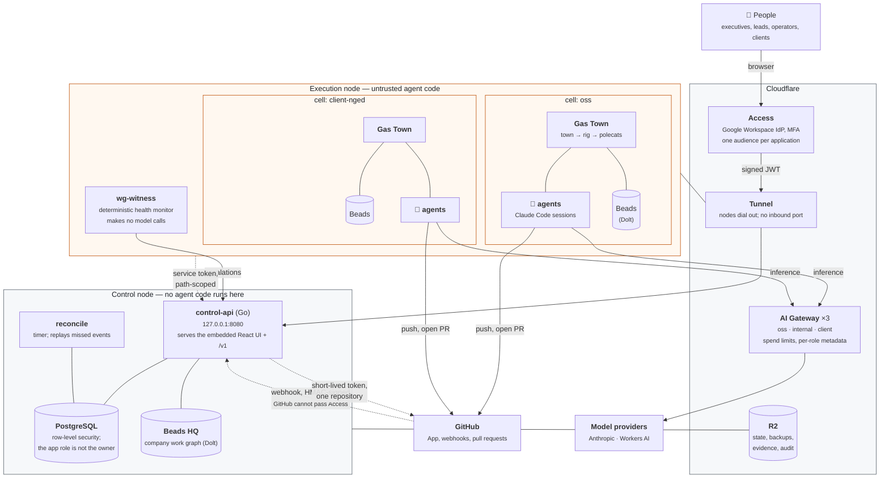
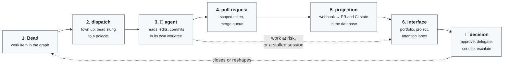

# Datopian Workgraph

A shared, permissioned company control plane: one durable work graph, a company-wide attention
layer, and controlled execution by humans and agents.

- **Work state** lives in Beads/Dolt.
- **Software execution** happens in isolated Gas Town execution cells.
- **Durable knowledge** lives in reviewed Beads and Git-native documents.
- **Code, infrastructure, policy, and reviewed knowledge** live in GitHub, and change through
  pull requests.

The implementation specification is the approved baseline v1.1 in
[`datopian/company-workgraph`](https://github.com/datopian/company-workgraph) under `plan/`.
Decisions that shape this codebase are recorded in [`docs/adr/`](docs/adr/).

## How it fits together

Two machines, neither with an inbound port. Everything a person touches goes through Cloudflare
Access first; everything an agent touches is scoped to one security domain.



The dashed edges are the ones that matter for security:

- **A cell never holds a git credential.** It asks `control-api` for a token scoped to one
  repository, over an Access application bound to that single path, and gets one that expires
  within the hour. The GitHub App private key can mint tokens for *every* installed repository, so
  it stays on the control node where no agent code runs.
- **GitHub webhooks bypass Access**, because GitHub cannot complete an Access challenge. An
  HMAC signature is the only thing standing between that endpoint and anyone who learns its URL.
- **Cells cannot see each other.** Separate Linux users, `0700` homes, a `0711` cells root so one
  cannot even enumerate the others' names, cgroup limits, and `hidepid` so one cannot read
  another's process arguments — where a gateway token would otherwise be visible.

## How one unit of work moves



The town comes up for a dispatch and is torn down after it, in a trap rather than on the happy
path. Patrol agents that poll cost money for as long as they are running, whether or not there is
work — on one day of testing they made more requests than the work they were supervising. The
health monitor that replaced the largest of them makes no model calls at all.

Nothing on the return path approves itself. An agent can open a pull request; it cannot merge one,
widen a classification, or decide its own budget.

## Getting started

```bash
make bootstrap    # install the pinned gt/bd/dolt matrix (checksum-verified) and dependencies
export PATH="$PWD/.toolchain/bin:$PATH"
make check        # everything CI runs: fmt, vet, race tests, versions, migrations
make build        # build control-api, worker, and agentd into ./bin
```

`make bootstrap` downloads only release artefacts and verifies each SHA-256 against
[`versions.lock`](versions.lock). A mismatch aborts the install. Nothing resolves to `latest`.

## Layout

```
apps/web/          React + TypeScript user interface
cmd/               control-api, worker, agentd
internal/          domain logic and provider adapters
db/migrations/     forward-only SQL migrations
infra/             OpenTofu, Ansible, Cloudflare, Google integration resources
deploy/            Compose and systemd definitions
formulas/          Gas Town workflow formulas
policies/          policy bundles evaluated by the approval engine
evaluations/       golden and regression suites
docs/adr/          architecture decision records
docs/runbooks/     operator runbooks
docs/go-live/      the go-live evidence pack
test/              contract, integration, and end-to-end suites
versions.lock      the validated gt/bd/dolt compatibility matrix
```

## How work happens here

Read [`AGENTS.md`](AGENTS.md) before making a change. The short version:

- Every change is attached to a Bead. There is no Markdown TODO list.
- One Bead, one short-lived branch `bead/<id>-<slug>`, one pull request.
- `main` is protected; direct pushes fail, for humans and agents alike.
- Staging and production are deployment targets, never development environments. Every persistent
  change is represented in Git.
- Never commit a secret. Never upgrade `gt`, `bd`, or `dolt` independently. Never publish
  unreviewed model extraction. Never widen a classification. Nothing approves itself.

## Current state

Phase A — repository and governance bootstrap — is complete: repositories, ADRs, policies,
formulas, the pinned toolchain, the core schema, CI gates, and a building service and web
skeleton.

Phases B to I are tracked as Beads. Services intentionally fail closed where they are unfinished:
the production authenticator denies every request, `agentd` refuses jobs without a signed
capability, and `/health/ready` reports not-ready rather than claiming a health it cannot verify.
